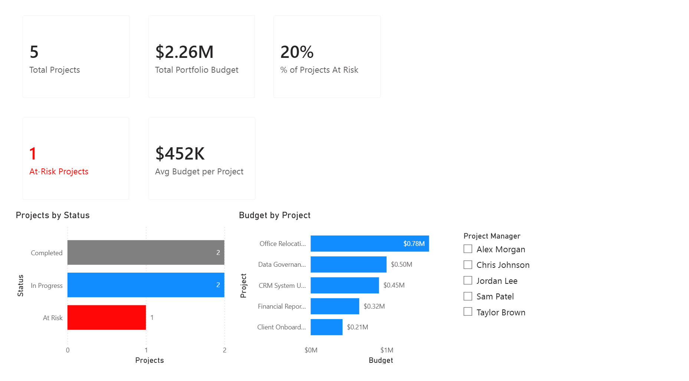
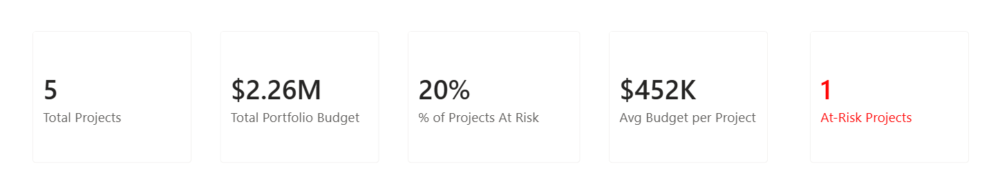

 Torey Richardson — Data Visualization & Analytics Portfolio

Practical, business‑focused analytics using Power BI (DAX), SQL, and Alteryx. I build executive‑ready dashboards that translate portfolio, financial, and operational data into clear decision‑making insights.

- 🎯 **What I do:** KPI design, semantic modeling, data prep, stakeholder reporting
- 🛠️ **Core tools:** Power BI (DAX, model), SQL, Alteryx (prep/automation)
- 💼 **Domains:** PMO/portfolio reporting, financial variance, process improvement (Lean CI)
- 🔗 **This repo:** Each project folder includes the dataset, measures/queries, a `.pbix` file, and screenshots + a README with the business story

## Dashboard Preview

### Portfolio Overview

### KPI Summary

