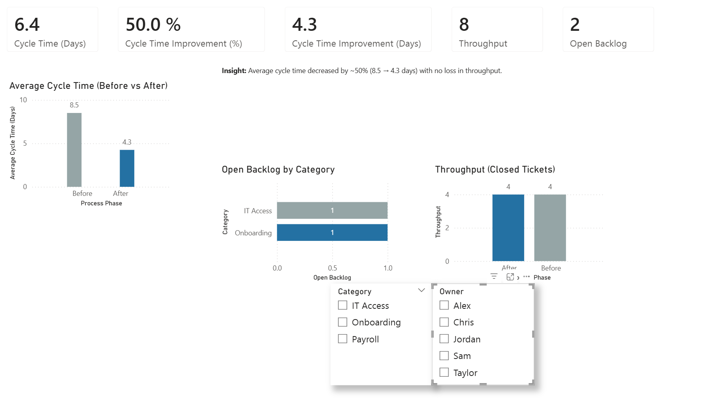
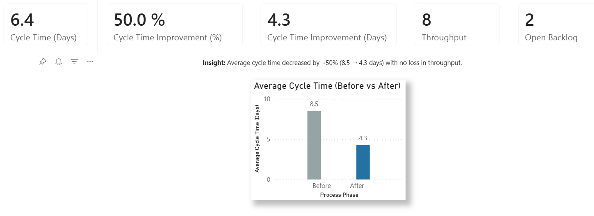

# Operational Process Improvement (Lean CI) Dashboard

**Goal:**  
Evaluate operational performance by analyzing **cycle time**, **backlog**, and **throughput**, and assess the impact of a process change using a clear **Before vs After** comparison.

This project demonstrates how Lean Continuous Improvement (CI) principles can be applied to operational data to identify bottlenecks, measure improvement, and validate that gains are achieved without sacrificing throughput.

---

## What the Dashboard Shows

### Operational KPIs
- **Cycle Time (Days)** – average time to complete a request  
- **Cycle Time Improvement (%)** – relative reduction in cycle time after the process change  
- **Cycle Time Improvement (Days)** – absolute reduction in cycle time  
- **Throughput** – number of requests completed  
- **Open Backlog** – number of open requests still in the system  

### Visual Insights
- **Average Cycle Time (Before vs After)** – headline improvement metric  
- **Open Backlog by Category** – highlights operational bottlenecks  
- **Throughput (Before vs After)** – validates that improvement was not achieved by reducing output  

### Interactivity
- **Category slicer** to explore where work accumulates  
- **Owner slicer** to understand workload distribution across team members  

---

## Data & Model

- **Dataset:** Synthetic operational ticket dataset (`ops_tickets.csv`) created for demonstration purposes  
- **Key Fields:**  
  - `ticket_id`  
  - `category`  
  - `owner`  
  - `opened_date`  
  - `closed_date`  
  - `status`  
  - `process_phase` (Before / After)  

- **Modeling Approach:**  
  - Clean, typed date fields for accurate duration calculations  
  - Reusable **DAX measures** to ensure consistent operational metrics  
  - Explicit Before/After phase comparison to support Lean CI analysis  

### Key DAX Measures
- `Avg Cycle Time by Phase` – average days between open and close for completed tickets  
- `Open Backlog` – count of tickets with status = Open  
- `Throughput` – count of tickets with status = Closed  
- `Cycle Time Improvement (Days)` – difference between Before and After cycle time  
- `Cycle Time Improvement (%)` – proportional improvement relative to the Before state  

---

## Tools Used
- **Power BI** (semantic modeling, DAX measures, operational dashboards, slicers)  
- **DAX** (cycle time calculations, backlog and throughput metrics, before/after comparison)  
- **Excel / CSV** (dataset creation and preparation)

---

## Dashboard Preview

### Operational Overview

### KPI + Cycle Time Improvement

---

## Key Takeaways
- Average cycle time was reduced by **~50% (8.5 → 4.3 days)** following the process change  
- **Throughput remained steady**, confirming improvement was not achieved by reducing capacity  
- Backlog visibility highlights where future improvement efforts should focus  

---

## Potential Enhancements
- Add **opened vs closed over time** to visualize flow stability  
- Introduce **aging analysis** for open backlog  
- Add **SLA or on‑time completion %** by category and owner  
- Expand the dataset to support longer‑term trend analysis
